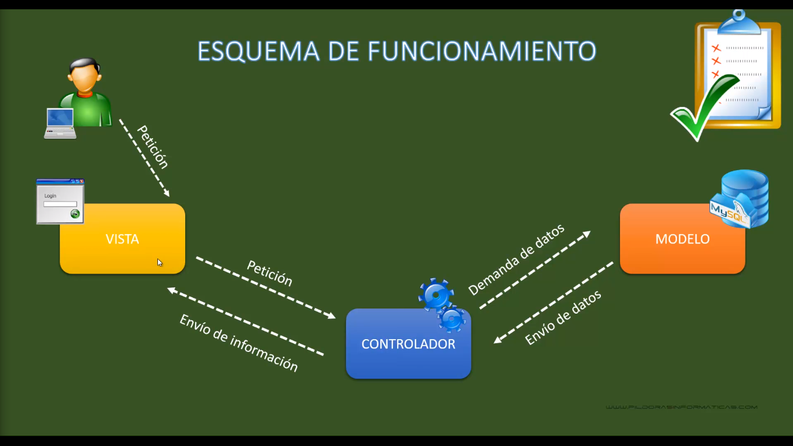

# MVC

## Modelo Vista Controlador I. Vídeo 78

El MVC (Modelo-Vista-Controlador) es un patrón de diseño arquitectónico ampliamente utilizado en el desarrollo de aplicaciones web y de software en general. Proporciona una estructura organizada y modular que separa la lógica de negocio, la presentación y la interacción del usuario en tres componentes principales: el modelo, la vista y el controlador.

A continuación, te explico brevemente cada uno de los componentes del MVC en PHP:

1. Modelo (Model): El modelo se encarga de representar la lógica de negocio y los datos de la aplicación. Es responsable de interactuar con la base de datos, realizar consultas, procesar datos y aplicar reglas de negocio. Además, encapsula los datos y proporciona métodos para acceder y modificar la información.

2. Vista (View): La vista es la capa de presentación que se encarga de mostrar la información al usuario. Representa la interfaz gráfica o la estructura de salida de la aplicación. En PHP, la vista está compuesta principalmente por archivos de plantillas (templates) que contienen código HTML y pueden incluir lógica de presentación utilizando etiquetas o directivas específicas del motor de plantillas utilizado.

3. Controlador (Controller): El controlador actúa como intermediario entre el modelo y la vista. Recibe las solicitudes del usuario, procesa la lógica necesaria y determina qué modelo utilizar y qué vista mostrar. Es responsable de manejar las interacciones del usuario, como recibir datos de formularios, realizar validaciones y tomar decisiones sobre el flujo de la aplicación. Una vez que se realiza el procesamiento, el controlador actualiza el modelo y selecciona la vista adecuada para mostrar los resultados.

La interacción entre estos componentes sigue un flujo establecido. El usuario interactúa con la vista, que envía una solicitud al controlador. El controlador procesa la solicitud, actualiza el modelo según sea necesario y selecciona la vista adecuada para mostrar los resultados. La vista utiliza los datos proporcionados por el controlador para generar la respuesta que se envía al usuario.

La separación de responsabilidades que ofrece el patrón MVC permite mejorar la modularidad, la legibilidad y el mantenimiento del código. Además, facilita la reutilización de componentes y promueve una arquitectura escalable y flexible.

Es importante mencionar que en PHP existen diferentes implementaciones y enfoques del patrón MVC, y su estructura exacta puede variar según el framework o la metodología utilizada.



Debemos definir nuestra estructura de carpetas como /model, /view, /controller y un index, el cual va en la raiz del proyecto y es el archivo de arranque
Los archivos en el controlador deben iniciar con Mayusuclas, los archivos en las vistas deben inicair con minisculas

```php
$pdo->setAttribute(PDO::ATTR_ERRMODE, PDO::ERRMODE_EXCEPTION);
```

Esta linea de código tiene como objetivo configurar el modo de manejo de errores para una instancia de la clase PDO en PHP.

Explicando cada parte:

- $pdo: Se refiere a una instancia de la clase PDO, que es utilizada para establecer una conexión con una base de datos y realizar operaciones relacionadas con ella.

- setAttribute(): Es un método de la clase PDO que permite establecer un atributo o configuración para la instancia de conexión.

- PDO::ATTR_ERRMODE: Es una constante predefinida en la clase PDO que representa el atributo relacionado con el modo de manejo de errores.

- PDO::ERRMODE_EXCEPTION: Es otra constante predefinida en la clase PDO que representa el modo de manejo de errores llamado "EXCEPTION" (excepción). Este modo configura PDO para que lance excepciones cuando se produzca un error en lugar de emitir advertencias o errores simples.

En resumen, la línea de código que mencionas configura la instancia de la clase PDO para que lance excepciones cuando ocurran errores, lo que facilita el manejo y la detección de problemas en la comunicación con la base de datos. Esto permite capturar y manejar los errores de manera más precisa y controlada en el código.

## Curso PHP MySql. Modelo Vista Controlador II. Vídeo 79

Comenzamos con los modelos, creamos un modelo que genere la conexion a la DB y otro archivo que obtenga los datos de nuestra tabla

## Curso PHP MySql. Modelo Vista Controlador III. Vídeo 80

Seguimos con la logica del controlador para instanciar nuestro Objeto del modelo, guardar los datos que nos devuelve, posteriormente pasarlos a la vista y en el index pasamos el controlador
