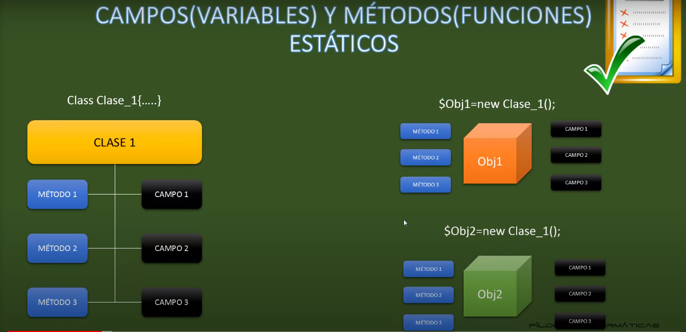
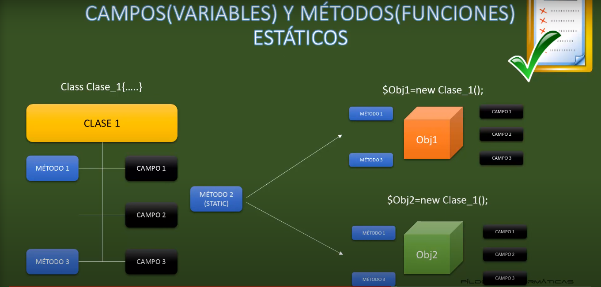

# POO PHP

## Programación Orientada a Objetos POO I. Vídeo 22

La Programación Orientada a Objetos (POO) es un paradigma de programación que se basa en el concepto de "objetos". Un objeto es una entidad que contiene datos y métodos (funciones) relacionados entre sí. En POO, los programas se estructuran en torno a la interacción entre estos objetos.

La POO se basa en cuatro conceptos fundamentales:

1. Clases: Una clase es una plantilla o un modelo para crear objetos. Define las propiedades (atributos) y los comportamientos (métodos) que los objetos de esa clase tendrán.

2. Objetos: Un objeto es una instancia de una clase. Representa una entidad concreta y puede tener su propio estado (valores de atributos) y comportamiento (métodos).

3. Encapsulación: Es un principio que consiste en ocultar los detalles internos de implementación de un objeto y proporcionar una interfaz para interactuar con él. Los atributos y métodos de un objeto pueden ser públicos, protegidos o privados para controlar su acceso desde fuera de la clase.

4. Herencia: La herencia permite crear nuevas clases basadas en clases existentes, heredando sus atributos y métodos. La clase existente se denomina "clase padre" o "superclase", y la nueva clase se denomina "clase hija" o "subclase". La herencia permite reutilizar código y establecer relaciones jerárquicas entre las clases.

La POO ayuda a organizar y modularizar el código, facilita la reutilización de código, mejora la mantenibilidad y favorece la abstracción y la resolución de problemas de manera más intuitiva.

## Programación Orientada a Objetos POO II. Vídeo 23

En la programación orientada a objetos (POO), las propiedades y atributos son términos que se utilizan indistintamente para referirse a las variables asociadas a una clase u objeto. Estas variables representan características o información que define el estado de un objeto y se utilizan para almacenar datos.

Propiedades: Son variables definidas dentro de una clase que representan las características o atributos del objeto. Cada objeto creado a partir de la clase tendrá su propia copia de estas propiedades, con valores individuales. Las propiedades son accesibles desde dentro de la clase y también pueden ser accedidas desde fuera de la clase, dependiendo de los modificadores de acceso establecidos. En el ejemplo del carro, las propiedades son marca, modelo, color y velocidad.

Atributos: El término "atributo" se utiliza a menudo como sinónimo de "propiedad". Al igual que las propiedades, los atributos representan las características o información asociada a un objeto. Los atributos definen el estado de un objeto y están representados por variables. En resumen, un atributo es una propiedad de un objeto o clase.

Constructor: es un método especial dentro de una clase que se invoca automáticamente cuando se crea una instancia u objeto de esa clase. Su función principal es inicializar las propiedades o atributos del objeto con los valores deseados.

```php

    class Coche
    {
        // Propiedades
        private $marca;
        private $modelo;
        private $color;
        var $ruedas;
        private $motor;
        private $velocidad;

        // Constructor -> Estado Inicial -> el método puede definirse como __construct o el nombre de la clase
        public function __construct()
        {
            $this->velocidad = 0;
            $this->motor;
            $this->ruedas = 4;
            $this->color;
            $this->modelo;
            $this->marca;
        }

        // Metodos
        function arrancar()
        {
            echo "Estoy arrancando <br>";
        }
        function girar()
        {
            echo "Estoy girando <br>";
        }
        function frenar()
        {
            echo "Estoy frenando <br>";
        }
    }
```

## Programación Orientada a Objetos POO III. Vídeo 24

Cómo instanciamos nuestros Objetos con sus métodos?

```php

    include "vehiculo.php";

    // Generamos nuestras instancias
    $ferrari = new Coche("rojo ferrari", "Ferrari", "La Ferrari");
    // $mazda = new Coche("rojo mazda", "Mazda", "A3");
    // $datsun = new Coche("azul", "Datsun", "68 bluebird");

    // Impirmimos los métodos de nuestras instancias
    $ferrari->arrancar();
    // $mazda->girar();
    // $datsun->frenar();
    // echo $datsun->ruedas;

    // Métodos setters y getters
    $ferrari->setMotor("1.6 cilindros");
    // $mazda->setMotor("1.2 cilindros");
    // $datsun->setMotor("1.4 cilindros");

    $ferrari->getColor();
    // $mazda->getColor();
    // $datsun->getColor();


    $optimus = new Camion("Azul y rojo", "Mercedes Benz", "Freightliner");

    $optimus->getColor();
```

## Programación Orientada a Objetos POO IV. Herencia. Vídeo 25

La herencia es un concepto fundamental en la programación orientada a objetos (POO) que permite crear nuevas clases basadas en clases existentes. Es un mecanismo que permite a una clase adquirir las propiedades (atributos) y comportamientos (métodos) de otra clase, estableciendo una relación jerárquica entre ellas.

En POO, la clase existente se denomina "clase padre" o "superclase", y la nueva clase creada se denomina "clase hija" o "subclase". La clase hija hereda todos los atributos y métodos de la clase padre, y además puede agregar nuevos atributos y métodos, modificar los existentes o incluso definir sus propios métodos especializados.

La herencia proporciona varios beneficios, entre ellos:

- Reutilización de código:Al heredar propiedades y métodos de una clase padre, la clase hija puede aprovechar y reutilizar el código existente, evitando la duplicación y mejorando la eficiencia.

- Abstracción y generalización: La herencia permite establecer una relación de generalización y especialización entre las clases. La clase padre puede representar una entidad más general, mientras que las clases hijas pueden representar entidades más específicas con características adicionales o modificaciones.

- Polimorfismo: Las clases hijas pueden proporcionar implementaciones específicas de los métodos heredados de la clase padre, lo que permite el polimorfismo. Esto significa que se pueden invocar los mismos métodos de diferentes objetos, pero ejecutarán comportamientos diferentes según la clase a la que pertenezcan.

La herencia se lleva a cabo con la palabra extends

```php
class Vehiculo {
    public $marca;
    public $modelo;

    public function __construct($marca, $modelo) {
        $this->marca = $marca;
        $this->modelo = $modelo;
    }
}

class Carro extends Vehiculo {
    public $puertas;

    public function __construct($marca, $modelo, $puertas) {
        parent::__construct($marca, $modelo);
        $this->puertas = $puertas;
    }
}
```

En PHP, parent:: es una construcción que permite acceder a los elementos de la clase padre desde la clase hija. Se utiliza para llamar a métodos o acceder a propiedades de la clase padre dentro de la clase hija.

Cuando se utiliza parent::, se hace referencia a la clase padre inmediata en la jerarquía de herencia. Esto permite acceder a los métodos y propiedades heredados de la clase padre, incluso si han sido sobrescritos en la clase hija.

Por ejemplo, si tienes una clase hija que ha sobrescrito un método de la clase padre, pero deseas utilizar la implementación original del método de la clase padre en la clase hija, puedes utilizar parent:: para llamar al método de la clase padre.

Aquí tienes un ejemplo:

```php
class Padre {
    public function metodo() {
        echo "Método de la clase padre";
    }
}

class Hijo extends Padre {
    public function metodo() {
        echo "Método de la clase hija";
        // Llamada al método de la clase padre
        parent::metodo();
    }
}
```

$hijo = new Hijo();
$hijo->metodo();
En este ejemplo, la clase "Hijo" hereda de la clase "Padre" y sobrescribe el método metodo(). Dentro del método metodo() de la clase "Hijo", se utiliza parent::metodo() para llamar al método de la clase padre y mostrar "Método de la clase padre" además del mensaje "Método de la clase hija".

La construcción parent:: también se puede utilizar para acceder a propiedades de la clase padre si están definidas como protegidas o públicas.

En resumen, parent:: permite acceder y llamar a métodos y acceder a propiedades de la clase padre dentro de la clase hija. Es útil cuando se quiere utilizar o extender la funcionalidad de la clase padre en la clase hija.

## Programación Orientada a Objetos POO V. Modificadores de acceso I. Vídeo 26

### Modularización

La modularización es un principio de diseño de software que implica dividir un sistema en módulos independientes y cohesivos. Consiste en organizar y estructurar el código en unidades más pequeñas y manejables, llamadas módulos, con el objetivo de mejorar la legibilidad, la reutilización y el mantenimiento del software.

Un módulo es una unidad lógica y funcional que encapsula un conjunto de código relacionado, como funciones, clases o componentes, que trabajan juntos para cumplir una tarea específica. Cada módulo se enfoca en una sola responsabilidad y puede ser desarrollado, probado y mantenido de manera independiente.

La modularización tiene varios beneficios, entre ellos:

Reutilización de código: Los módulos pueden ser utilizados en diferentes partes de una aplicación o incluso en diferentes proyectos, lo que ahorra tiempo y esfuerzo al no tener que escribir el mismo código nuevamente.

Legibilidad y mantenibilidad: Dividir el código en módulos más pequeños facilita su comprensión, ya que cada módulo se enfoca en una funcionalidad específica. Además, los cambios y correcciones se pueden realizar de manera aislada en un módulo sin afectar a otros, lo que facilita el mantenimiento del software.

Testabilidad: Los módulos más pequeños son más fáciles de probar de manera aislada, lo que facilita la detección de errores y el desarrollo de pruebas unitarias.

Colaboración: La modularización permite que diferentes desarrolladores trabajen en paralelo en diferentes módulos sin interferir en el código de los demás. Esto mejora la colaboración y la productividad en equipos de desarrollo.

Para lograr una buena modularización, es recomendable seguir algunos principios de diseño, como el principio de responsabilidad única (SRP), que establece que cada módulo debe tener una única responsabilidad, y el principio de dependencia mínima (DIP), que sugiere que los módulos deben depender de abstracciones en lugar de implementaciones concretas.

En resumen, la modularización es una práctica de diseño de software que implica dividir el código en módulos cohesivos e independientes. Esto facilita la reutilización, el mantenimiento y la legibilidad del código, y promueve una arquitectura más robusta y flexible.

### Encapsulación

La encapsulación es uno de los principios fundamentales de la programación orientada a objetos (POO). Se refiere al mecanismo que permite ocultar los detalles internos de un objeto y proporcionar una interfaz controlada para acceder y manipular sus datos y comportamientos.

En la encapsulación, se define una clase que encapsula o envuelve tanto los datos (propiedades) como los métodos (comportamientos) relacionados dentro de un único objeto. Los datos se mantienen privados, lo que significa que solo se pueden acceder y modificar desde dentro de la misma clase. Sin embargo, se pueden proporcionar métodos públicos (llamados métodos de acceso o getters y setters) para permitir el acceso controlado a los datos encapsulados desde el exterior de la clase.

La encapsulación ofrece varios beneficios:

Protección de datos: Al mantener los datos privados, se evita que se modifiquen o accedan de manera incorrecta desde fuera de la clase. Esto asegura que los datos solo puedan ser manipulados a través de la interfaz proporcionada por los métodos públicos, lo que ayuda a mantener la integridad de los datos y prevenir errores.

Abstracción: Al ocultar los detalles internos del objeto y proporcionar una interfaz clara y coherente, la encapsulación permite que los usuarios del objeto se centren en cómo usarlo en lugar de preocuparse por su implementación interna. Esto promueve la abstracción y simplifica el uso y la comprensión del objeto.

Flexibilidad: Al encapsular los datos y comportamientos en un objeto, se puede modificar la implementación interna del objeto sin afectar el código que utiliza el objeto. Esto permite realizar cambios internos sin impactar en el código externo, lo que facilita el mantenimiento y la evolución del sistema.

En resumen, la encapsulación en la programación orientada a objetos es el mecanismo mediante el cual se ocultan los detalles internos de un objeto y se proporciona una interfaz controlada para acceder y manipular sus datos y comportamientos. Es un principio clave que promueve la protección de datos, la abstracción y la flexibilidad en el diseño de software.

### Modificadores de acceso

En la programación orientada a objetos, los modificadores de acceso son palabras clave que se utilizan para controlar el nivel de acceso a las propiedades y métodos de una clase. Estos modificadores definen qué partes del código pueden acceder y manipular los miembros de una clase.

En PHP, existen tres modificadores de acceso:

Public: Cuando se declara una propiedad o método como público (public), este puede ser accedido desde cualquier parte del programa, ya sea desde dentro de la clase, desde una clase heredera o desde cualquier otro contexto.

```php

class Ejemplo {
public $propiedadPublica;

    public function metodoPublico() {
        // Código del método
    }

}

$objeto = new Ejemplo();
$objeto->propiedadPublica = "Valor"; // Acceso a propiedad pública
$objeto->metodoPublico(); // Acceso a método público
```

Protected: Cuando se declara una propiedad o método como protegido (protected), este es accesible desde la clase que lo define y desde cualquier clase heredera, pero no puede ser accedido desde contextos externos.

```php

class Ejemplo {
protected $propiedadProtegida;

    protected function metodoProtegido() {
        // Código del método
    }

}

class ClaseHija extends Ejemplo {
public function otroMetodo() {
$this->propiedadProtegida = "Valor"; // Acceso a propiedad protegida desde clase heredera
$this->metodoProtegido(); // Acceso a método protegido desde clase heredera
}
}

$objeto = new Ejemplo();
$objeto->propiedadProtegida = "Valor"; // ERROR: Acceso inválido desde contexto externo
$objeto->metodoProtegido(); // ERROR: Acceso inválido desde contexto externo
```

Private: Cuando se declara una propiedad o método como privado (private), este es accesible únicamente desde la clase que lo define. No puede ser accedido ni modificado desde contextos externos ni desde clases herederas.

```php

class Ejemplo {
private $propiedadPrivada;

    private function metodoPrivado() {
        // Código del método
    }

}

$objeto = new Ejemplo();
$objeto->propiedadPrivada = "Valor"; // ERROR: Acceso inválido desde contexto externo
$objeto->metodoPrivado(); // ERROR: Acceso inválido desde contexto externo
```

Los modificadores de acceso permiten controlar el nivel de encapsulación de los miembros de una clase, determinando qué partes del código pueden acceder a ellos. Esto es fundamental para garantizar la integridad de los datos y promover una estructura coherente y segura en el diseño de software orientado a objetos.

## Orientada a Objetos POO VII. Variables y métodos estáticos. Vídeo 28

Cuando tenemos una clase con métodos y campos e instanciamos uno o más objetos, estos objetos crean una copia de esos mismos métodos y campos (cada uno tiene su propia copia) y se puede comportar de manera diferente


Cuando se genera un método estatico o un campo estatico, las instancias no tendrán una copia del método, la clase tendrá este único método y lo compartirá a las instancias
Para acceder a nuestros metodos estaticos o campos estaticos necesitamos usar self::
Lo útil de los métodos y campos estaticos es que se comparten a todos las instancias, por tanto solo debemos hacer uso de ello con self::, nos ayuda a no reescribir código

